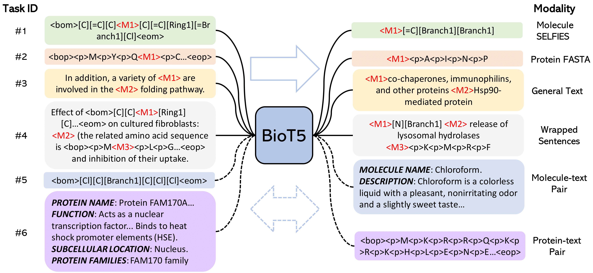
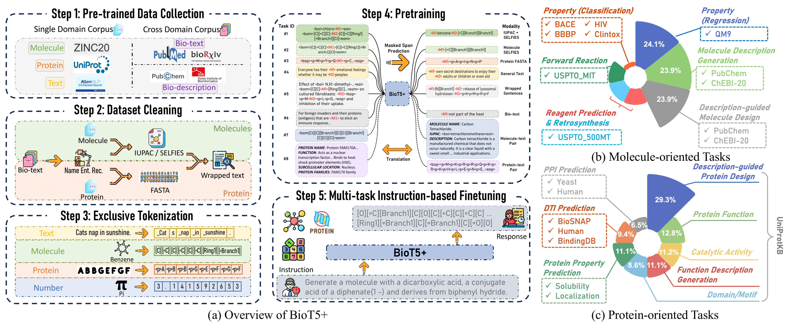

<h1 align="center">
BioT5: Enriching Cross-modal Integration in Biology with Chemical Knowledge and Natural Language Associations 🔥
</h1>

<div align="center">

[](https://arxiv.org/abs/2310.07276)
[](https://arxiv.org/abs/2402.17810)
[](https://github.com/QizhiPei/BioT5) 
[](https://huggingface.co/QizhiPei/biot5-base) 
[](https://huggingface.co/datasets/QizhiPei/BioT5_finetune_dataset)
[](https://github.com/QizhiPei/Awesome-Biomolecule-Language-Cross-Modeling)
[](https://pytorch.org/get-started/locally/)

</div>


## News
🔥***Mar 03 2024***: *We have published a suvery paper [Leveraging Biomolecule and Natural Language through Multi-Modal Learning: A Survey](https://arxiv.org/abs/2403.01528) and the related github repository [Awesome-Biomolecule-Language-Cross-Modeling](https://github.com/QizhiPei/Awesome-Biomolecule-Language-Cross-Modeling). Kindly check it if you are interested in this field~*

🔥***Feb 29 2024***: *Update [BioT5](https://arxiv.org/abs/2310.07276) to [BioT5+](https://arxiv.org/abs/2402.17810) with the ability of IUPAC integration and multi-task learning! Code and data will be relased ASAP.*

🔥***Nov 06 2023***: *Update [example usage](#example-usage) for molecule captioning, text-based molecule generation, drug-target interaction prediction!*

🔥***Oct 20 2023***: *The [data](#data) for fine-tuning is released!*

🔥***Oct 19 2023***: *The pre-trained and fine-tuned [models](#models) are released!*

🔥***Oct 11 2023***: *Initial commits. More codes, pre-trained model, and data are coming soon.*


## Overview
This repository contains the source code for 

* *EMNLP 2023* paper "[BioT5: Enriching Cross-modal Integration in Biology with Chemical Knowledge and Natural Language Associations](https://arxiv.org/abs/2310.07276)", by Qizhi Pei, Wei Zhang, Jinhua Zhu, Kehan Wu, Kaiyuan Gao, Lijun Wu, Yingce Xia, and Rui Yan. BioT5 achieves superior performance on various biological tasks.
* *Arxiv 2024* paper "[BioT5+: Towards Generalized Biological Understanding with IUPAC Integration and Multi-task Tuning](https://arxiv.org/abs/2402.17810)", by Qizhi Pei, Lijun Wu, Kaiyuan Gao, Xiaozhuan Liang, Yin Fang, Jinhua Zhu, Shufang Xie, Tao Qin, Rui Yan. BioT5+ is pre-trained and fine-tuned with a large number of experiments, including **3 types of problems (classification, regression, generation), 15 kinds of tasks, and 21 total benchmark datasets**, demonstrating the remarkable performance and state-of-the-art results in most cases.
* If you have questions, don't hesitate to open an issue or ask me via <qizhipei@ruc.edu.cn> or Lijun Wu via <lijuwu@microsoft.com>. We are happy to hear from you!

**↓Overview of BioT5**


**↓Overview of BioT5+**



## Setup Environment
As the data for fine-tuning is also included in the GitHub, you need to install git-lfs to pull the data correctly.
This is an example for how to set up a working conda environment to run the code.
```shell
sudo apt-get install git-lfs # run this if you have not installed git-lfs
git lfs install
git clone https://github.com/QizhiPei/BioT5.git --recursive
cd BioT5
conda create -n biot5 python=3.8
conda activate biot5
pip install -r requirements.txt
```

## Example Usage
You can adjust the model and generation configs according to your needs.
### Molecule Captioning
```python
from transformers import T5Tokenizer, T5ForConditionalGeneration

tokenizer = T5Tokenizer.from_pretrained("QizhiPei/biot5-base-mol2text", model_max_length=512)
model = T5ForConditionalGeneration.from_pretrained('QizhiPei/biot5-base-mol2text')

task_definition = 'Definition: You are given a molecule SELFIES. Your job is to generate the molecule description in English that fits the molecule SELFIES.\n\n'
selfies_input = '[C][C][Branch1][C][O][C][C][=Branch1][C][=O][C][=Branch1][C][=O][O-1]'
task_input = f'Now complete the following example -\nInput: <bom>{selfies_input}<eom>\nOutput: '

model_input = task_definition + task_input
input_ids = tokenizer(model_input, return_tensors="pt").input_ids

generation_config = model.generation_config
generation_config.max_length = 512
generation_config.num_beams = 1

outputs = model.generate(input_ids, generation_config=generation_config)

print(tokenizer.decode(outputs[0], skip_special_tokens=True))
```

### Text-based Molecule Generation
```python
from transformers import T5Tokenizer, T5ForConditionalGeneration

tokenizer = T5Tokenizer.from_pretrained("QizhiPei/biot5-base-text2mol", model_max_length=512)
model = T5ForConditionalGeneration.from_pretrained('QizhiPei/biot5-base-text2mol')

task_definition = 'Definition: You are given a molecule description in English. Your job is to generate the molecule SELFIES that fits the description.\n\n'
text_input = 'The molecule is a monocarboxylic acid anion obtained by deprotonation of the carboxy and sulfino groups of 3-sulfinopropionic acid. Major microspecies at pH 7.3 It is an organosulfinate oxoanion and a monocarboxylic acid anion. It is a conjugate base of a 3-sulfinopropionic acid.'
task_input = f'Now complete the following example -\nInput: {text_input}\nOutput: '

model_input = task_definition + task_input
input_ids = tokenizer(model_input, return_tensors="pt").input_ids

generation_config = model.generation_config
generation_config.max_length = 512
generation_config.num_beams = 1

outputs = model.generate(input_ids, generation_config=generation_config)
output_selfies = tokenizer.decode(outputs[0], skip_special_tokens=True).replace(' ', '')
print(output_selfies)

import selfies as sf
output_smiles = sf.decoder(output_selfies)
print(output_smiles)
```

### Drug-target Interaction Prediction
```python
from transformers import T5Tokenizer, T5ForConditionalGeneration

def add_prefix_to_amino_acids(protein_sequence):
    amino_acids = list(protein_sequence)
    prefixed_amino_acids = ['<p>' + aa for aa in amino_acids]
    new_sequence = ''.join(prefixed_amino_acids)
    return new_sequence

tokenizer = T5Tokenizer.from_pretrained("QizhiPei/biot5-base-dti-human", model_max_length=512)
model = T5ForConditionalGeneration.from_pretrained('QizhiPei/biot5-base-dti-human')

task_definition = 'Definition: Drug target interaction prediction task (a binary classification task) for the human dataset. If the given molecule and protein can interact with each other, indicate via "Yes". Otherwise, response via "No".\n\n'
selfies_input = '[C][/C][=C][Branch1][C][\\C][C][=Branch1][C][=O][O]'
protein_input = 'MQALRVSQALIRSFSSTARNRFQNRVREKQKLFQEDNDIPLYLKGGIVDNILYRVTMTLCLGGTVYSLYSLGWASFPRN'
protein_input = add_prefix_to_amino_acids(protein_input)
task_input = f'Now complete the following example -\nInput: Molecule: <bom>{selfies_input}<eom>\nProtein: <bop>{protein_input}<eop>\nOutput: '

model_input = task_definition + task_input
input_ids = tokenizer(model_input, return_tensors="pt").input_ids

generation_config = model.generation_config
generation_config.max_length = 8
generation_config.num_beams = 1

outputs = model.generate(input_ids, generation_config=generation_config)

print(tokenizer.decode(outputs[0], skip_special_tokens=True))
```

## Data
The datasets for fine-tuning with instruction format can be downloaded from [HuggingFace 🤗](https://huggingface.co/datasets/QizhiPei/BioT5_finetune_dataset).
We don't wrap the dataset into HuggingFace Dataset format but only use it to store our data.
If you don't clone the BioT5 recursively `git clone https://github.com/QizhiPei/BioT5.git --recursive`, you need to manually clone it by:
```bash
git clone https://huggingface.co/datasets/QizhiPei/BioT5_finetune_dataset data
```

## Models

|Model|Description|HuggingFace Checkpoint 🤗|
|----|----|---|
|BioT5|Pre-trained BioT5|[link](https://huggingface.co/QizhiPei/biot5-base)|
|BioT5-Molecule Captioning|Fine-tuned BioT5 for molecule captioning task on ChEBI-20|[link](https://huggingface.co/QizhiPei/biot5-base-mol2text)|
|BioT5-Text Based Molecule Generation|Fine-tuned BioT5 for text based molecule generation task on ChEBI-20|[link](https://huggingface.co/QizhiPei/biot5-base-text2mol)|
|BioT5-DTI|Fine-tuned BioT5 for drug-target interaction task|[bindingdb](https://huggingface.co/QizhiPei/biot5-base-dti-bindingdb) <br> [biosnap](https://huggingface.co/QizhiPei/biot5-base-dti-biosnap) <br> [human](https://huggingface.co/QizhiPei/biot5-base-dti-human)|
|BioT5-PPI-Human|Fine-tuned BioT5 for protein-protein interaction task with human dataset on PEER benchmark|[link](https://huggingface.co/QizhiPei/biot5-base-peer-human_ppi)|
|BioT5-PPI-Yeast|Fine-tuned BioT5 for protein-protein interaction task with yeast dataset on PEER benchmark|[link](https://huggingface.co/QizhiPei/biot5-base-peer-yeast_ppi)|
|BioT5-Solubility|Fine-tuned BioT5 for protein solubility prediction task on PEER benchmark|[link](https://huggingface.co/QizhiPei/biot5-base-peer-solubility)|
|BioT5-Binloc|Fine-tuned BioT5 for protein binary localization prediction task on PEER benchmark|[link](https://huggingface.co/QizhiPei/biot5-base-peer-binloc)|

We don't include fine-tuned models on MoleculeNet benchmark as there are too many subtasks.

## Fine-tuning
```
export task={mol2text,text2mol,dti,peer}
export model_path="path_to_your_model"
export log_path="logs/test_tmp"
export n_node=1
export n_gpu_per_node=1

bash finetune.sh
```
The parameter to control downstream tasks corresponds to file names in `biot5/configs/task/*.yaml`. You can change the `n_node` and `n_gpu_per_node` as needed.

## Evaluation
```
export task={mol2text,text2mol,dti,peer}
export result_file_path="tmp.tsv"
export model_path="path_to_your_model"
export log_path="logs/test_tmp"

bash evaluation.sh
```
We only test the evaluation code with a single gpu.

## About
### Citations
```
@article{pei2023biot5,
  title={BioT5: Enriching Cross-modal Integration in Biology with Chemical Knowledge and Natural Language Associations},
  author={Pei, Qizhi and Zhang, Wei and Zhu, Jinhua and Wu, Kehan and Gao, Kaiyuan and Wu, Lijun and Xia, Yingce and Yan, Rui},
  journal={arXiv preprint arXiv:2310.07276},
  year={2023}
}
```

### Acknowledegments
The code is based on [nanoT5](https://github.com/PiotrNawrot/nanoT5).
