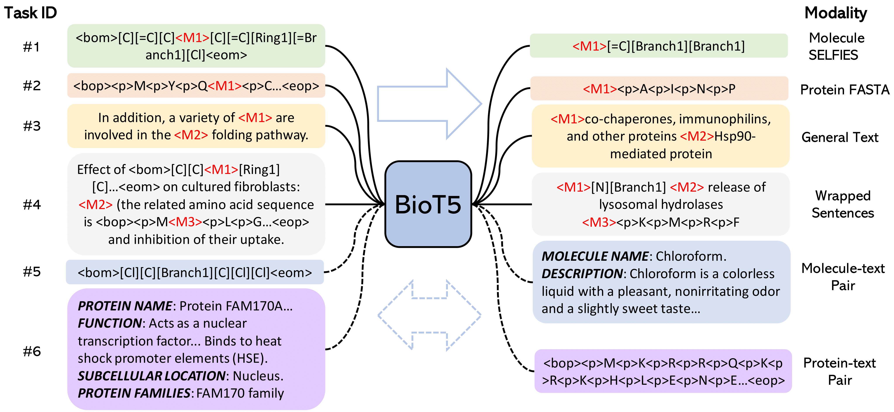

<h1 align="center">
BioT5: Enriching Cross-modal Integration in Biology with Chemical Knowledge and Natural Language Associations 🔥
</h1>

<div align="center">

[](https://arxiv.org/abs/2310.07276)
[](https://github.com/QizhiPei/BioT5) 
[](https://huggingface.co/QizhiPei/BioT5) 
[](https://huggingface.co/datasets/QizhiPei/BioT5_finetune_dataset)
[](https://pytorch.org/get-started/locally/)

</div>

## Overview
This repository contains the source code for *EMNLP 2023* paper "[BioT5: Enriching Cross-modal Integration in Biology with Chemical Knowledge and Natural Language Associations](https://arxiv.org/abs/2310.07276)", by Qizhi Pei, Wei Zhang, Jinhua Zhu, Kehan Wu, Kaiyuan Gao, Lijun Wu, Yingce Xia, and Rui Yan. BioT5 achieves superior performance on various biological tasks. If you have questions, don't hesitate to open an issue or ask me via <qizhipei@ruc.edu.cn> or Lijun Wu via <lijuwu@microsoft.com>. We are happy to hear from you!



## News
**Oct 20 2023**: The data for fine-tuning is released!

**Oct 19 2023**: The pre-trained and fine-tuned models are released!

**Oct 11 2023**: Initial commits. More codes, pre-trained model, and data are coming soon.

## Setup Environment
This is an example for how to set up a working conda environment to run the code.
```
git clone https://github.com/QizhiPei/BioT5.git
cd BioT5
conda create -n biot5 python=3.8
conda activate biot5
pip install -r requirements.txt
```

## Data
The datasets for fine-tuning with instruction format can be downloaded from [Huggingface 🤗](https://huggingface.co/datasets/QizhiPei/BioT5_finetune_dataset).

## Models

|Model|Description|Huggingface Checkpoint 🤗|
|----|----|---|
|BioT5|Pre-trained BioT5|[link](https://huggingface.co/QizhiPei/biot5-base)|
|BioT5-Molecule Captioning|Fine-tuned BioT5 for molecule captioning task on ChEBI-20|[link](https://huggingface.co/QizhiPei/biot5-base-mol2text)|
|BioT5-Text Based Molecule Generation|Fine-tuned BioT5 for text based molecule generation task on ChEBI-20|[link](https://huggingface.co/QizhiPei/biot5-base-text2mol)|
|BioT5-DTI|Fine-tuned BioT5 for drug-target interaction task|[bindingdb](https://huggingface.co/QizhiPei/biot5-base-dti-bindingdb) <br> [biosnap](https://huggingface.co/QizhiPei/biot5-base-dti-biosnap) <br> [human](https://huggingface.co/QizhiPei/biot5-base-dti-human)|
|BioT5-PPI-Human|Fine-tuned BioT5 for protein-protein interaction task with human dataset on PEER benchmark|[link](https://huggingface.co/QizhiPei/biot5-base-peer-human_ppi)|
|BioT5-PPI-Yeast|Fine-tuned BioT5 for protein-protein interaction task with yeast dataset on PEER benchmark|[link](https://huggingface.co/QizhiPei/biot5-base-peer-yeast_ppi)|
|BioT5-Solubility|Fine-tuned BioT5 for protein solubility prediction task on PEER benchmark|[link](https://huggingface.co/QizhiPei/biot5-base-peer-solubility)|
|BioT5-Binloc|Fine-tuned BioT5 for protein binary localization prediction task on PEER benchmark|[link](https://huggingface.co/QizhiPei/biot5-base-peer-binloc)|

We don't include fine-tuned models on MoleculeNet benchmark as there are too many subtasks.

## Fine-tuning
```
export task={mol2text,text2mol,dti,peer}
export n_node=1
export n_gpu_per_node=1

bash finetune.sh
```
The parameter to control downstream tasks corresponds to file names in `biot5/configs/task/*.yaml`. You can change the `n_node` and `n_gpu_per_node` as needed.

## Evaluation
```
export task={mol2text,text2mol,dti,peer}
export result_file_path="tmp.tsv"
export model_path="path_to_your_model"
export task_dir="biot5/data/tasks"
export data_dir="biot5/data/splits/dti/dti_biosnap"
export log_path="path_to_your_log"

bash evaluation.sh
```
We only test the evaluation code with a single gpu.

## About
### Citations
```
@article{pei2023biot5,
  title={BioT5: Enriching Cross-modal Integration in Biology with Chemical Knowledge and Natural Language Associations},
  author={Pei, Qizhi and Zhang, Wei and Zhu, Jinhua and Wu, Kehan and Gao, Kaiyuan and Wu, Lijun and Xia, Yingce and Yan, Rui},
  journal={arXiv preprint arXiv:2310.07276},
  year={2023}
}
```

### Acknowledegments
The code is based on [nanoT5](https://github.com/PiotrNawrot/nanoT5).
