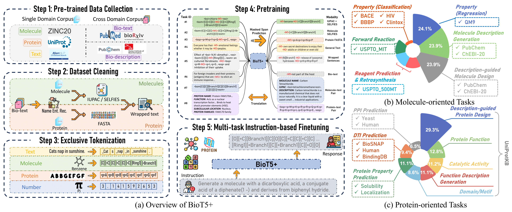

# BioT5+
**↓Overview of BioT5+**



## Setup Environment
As the data for fine-tuning is also included in the GitHub, you need to install git-lfs to pull the data correctly.
This is an example for how to set up a working conda environment to run the code.
```shell
sudo apt-get install git-lfs # run this if you have not installed git-lfs
git lfs install
git clone https://github.com/QizhiPei/BioT5.git --recursive
cd BioT5
conda create -n biot5_plus python=3.8
conda activate biot5_plus
# install the pytorch compatible with your cuda
pip install torch==2.0.1 torchvision==0.15.2 torchaudio==2.0.2
pip install -r requirements.txt
```

## Example Usage
You can adjust the model and generation configs according to your needs.
### Molecule Captioning
```python
from transformers import T5Tokenizer, T5ForConditionalGeneration

tokenizer = T5Tokenizer.from_pretrained("QizhiPei/biot5-plus-base-chebi20", model_max_length=512)
model = T5ForConditionalGeneration.from_pretrained('QizhiPei/biot5-plus-base-chebi20')

task_definition = 'Definition: You are given a molecule SELFIES. Your job is to generate the molecule description in English that fits the molecule SELFIES.\n\n'
selfies_input = '[C][C][Branch1][C][O][C][C][=Branch1][C][=O][C][=Branch1][C][=O][O-1]'
task_input = f'Now complete the following example -\nInput: <bom>{selfies_input}<eom>\nOutput: '

model_input = task_definition + task_input
input_ids = tokenizer(model_input, return_tensors="pt").input_ids

generation_config = model.generation_config
generation_config.max_length = 512
generation_config.num_beams = 1

outputs = model.generate(input_ids, generation_config=generation_config)

print(tokenizer.decode(outputs[0], skip_special_tokens=True))
```

### Text-based Molecule Generation
```python
from transformers import T5Tokenizer, T5ForConditionalGeneration

tokenizer = T5Tokenizer.from_pretrained("QizhiPei/biot5-plus-base-chebi20", model_max_length=512)
model = T5ForConditionalGeneration.from_pretrained('QizhiPei/biot5-plus-base-chebi20')

task_definition = 'Definition: You are given a molecule description in English. Your job is to generate the molecule SELFIES that fits the description.\n\n'
text_input = 'The molecule is a monocarboxylic acid anion obtained by deprotonation of the carboxy and sulfino groups of 3-sulfinopropionic acid. Major microspecies at pH 7.3 It is an organosulfinate oxoanion and a monocarboxylic acid anion. It is a conjugate base of a 3-sulfinopropionic acid.'
task_input = f'Now complete the following example -\nInput: {text_input}\nOutput: '

model_input = task_definition + task_input
input_ids = tokenizer(model_input, return_tensors="pt").input_ids

generation_config = model.generation_config
generation_config.max_length = 512
generation_config.num_beams = 1

outputs = model.generate(input_ids, generation_config=generation_config)
output_selfies = tokenizer.decode(outputs[0], skip_special_tokens=True).replace(' ', '')
print(output_selfies)

import selfies as sf
output_smiles = sf.decoder(output_selfies)
print(output_smiles)
```


## Data
The datasets for fine-tuning with instruction format can be downloaded from [HuggingFace 🤗](https://huggingface.co/datasets/QizhiPei/BioT5_finetune_dataset).
We don't wrap the dataset into HuggingFace Dataset format but only use it to store our data.
If you don't clone the BioT5 recursively `git clone https://github.com/QizhiPei/BioT5.git --recursive`, you need to manually clone it by:
```bash
git clone https://huggingface.co/datasets/QizhiPei/BioT5_finetune_dataset data
```

## Models

|Model|Description|HuggingFace Checkpoint 🤗|
|----|----|---|
|BioT5-base|Pre-trained BioT5+ base model|[link](https://huggingface.co/QizhiPei/biot5-plus-base)|
|BioT5-large|Pre-trained BioT5+ large model|[link](https://huggingface.co/QizhiPei/biot5-plus-large)|
|BioT5-mol-instructions (molecule)|Fine-tuned BioT5 for molecule-related tasks on Mol-Instructions dataset|[link](https://huggingface.co/QizhiPei/biot5-plus-base-mol-instructions-molecule)|
|BioT5-mol-instructions (protein)|Fine-tuned BioT5 for protein-related tasks on Mol-Instructions dataset|[link](https://huggingface.co/QizhiPei/biot5-plus-base-mol-instructions-protein)|
|BioT5-chebi20|Fine-tuned BioT5 for molecule captioning and text-based molecule generation tasks on ChEBI-20 dataset|[link](https://huggingface.co/QizhiPei/biot5-plus-base-chebi20)|


## Citations
@article{pei2024biot5+,
  title={BioT5+: Towards Generalized Biological Understanding with IUPAC Integration and Multi-task Tuning},
  author={Pei, Qizhi and Wu, Lijun and Gao, Kaiyuan and Liang, Xiaozhuan and Fang, Yin and Zhu, Jinhua and Xie, Shufang and Qin, Tao and Yan, Rui},
  journal={arXiv preprint arXiv:2402.17810},
  year={2024}
}
```